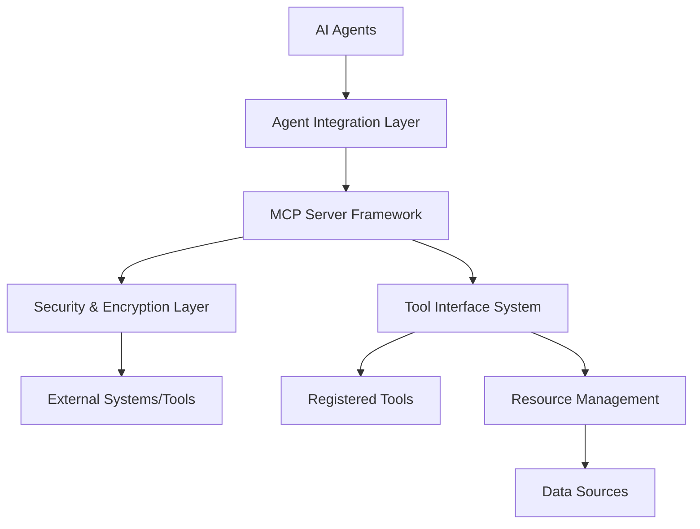

# Model Context Protocol (MCP) Server Architecture Design

## Overview

This document outlines the architecture for implementing Model Context Protocol (MCP) servers that will enable our AI agents to interact with external systems, tools, and data sources in a standardized and secure manner.

## Key Components

### 1. MCP Server Framework
- Implementation using the official `@modelcontextprotocol/sdk`
- Support for both stdio and HTTP transports
- JSON-RPC 2.0 message format compliance

### 2. Agent Integration Layer
- Interface between existing AI agents and MCP servers
- Translation layer for agent requests to MCP protocol
- Response handling and formatting for agents

### 3. Security & Encryption Layer
- End-to-end encryption for agent-to-agent communications
- TLS/SSL for agent-to-server communications
- User authentication and authorization mechanisms

### 4. Tool Interface System
- Standardized tool definitions for common agent tasks
- Dynamic tool registration based on agent roles
- Resource management for data access

## Architecture Diagram

## MCP Server Types

### 1. Executive MCP Server
- Handles high-level strategic tasks
- Integrates with C-Suite agent functions
- Access to executive-level tools and data

### 2. Director MCP Server
- Manages departmental operations
- VP-level task coordination
- Cross-functional data access

### 3. Manager MCP Server
- Team-level task management
- Project coordination tools
- Resource allocation functions

### 4. Contributor MCP Server
- Specialized tool access for individual contributors
- Domain-specific functionality
- Task execution capabilities

## Core Features

### 1. Resources
- File-like data access for agents
- API response integration
- Database query capabilities

### 2. Tools
- Function execution with user approval
- External system integration
- Side-effect management

### 3. Prompts
- Pre-written templates for common tasks
- Workflow automation
- Context-aware interactions

### 4. Encryption
- End-to-end encryption for sensitive communications
- TLS/SSL for data in transit
- Key management system

## Security Implementation

### 1. Transport Security
- TLS 1.3 for HTTP connections
- Secure key exchange protocols
- Certificate management

### 2. Message Encryption
- AES-256 for message content
- RSA-4096 for key exchange
- Perfect forward secrecy

### 3. Authentication
- JWT-based token system
- Role-based access control
- Multi-factor authentication support

## Integration Points

### 1. With Existing Agent Hierarchy
- Extension of current Agent base class
- MCP capabilities added to agent types
- Seamless communication between MCP and non-MCP agents

### 2. With Governance Framework
- AI Governance Council oversight
- Compliance checking for MCP operations
- Audit logging for all MCP activities

### 3. With Data Integration
- Connection to existing data flows
- API integration patterns
- Database access protocols

## Implementation Plan

### Phase 1: Core MCP Server Framework
- Basic MCP server implementation
- Resource and tool registration
- Stdio and HTTP transport support

### Phase 2: Agent Integration
- Adapter layer for existing agents
- Request/response translation
- Error handling and logging

### Phase 3: Security Implementation
- Encryption layer implementation
- Authentication system
- Authorization framework

### Phase 4: Tool Interface System
- Standard tool definitions
- Dynamic tool registration
- Resource management

### Phase 5: Testing and Deployment
- Unit and integration testing
- Security auditing
- Production deployment